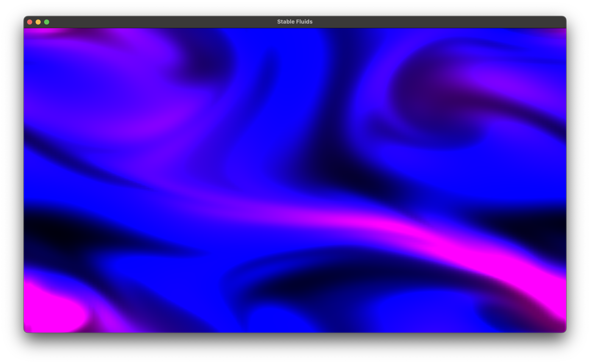

# OpenGL 3.3 Implementation of Jos Stam's Stable Fluids Demo

Jos Stam's original demo was written in C using GLUT for early versions of OpenGL. To begin learning real-time fluid simulation techniques I've begun by porting his demo to OpenGL 3.3, using [GLFW](https://www.glfw.org) and [GLAD](https://github.com/Dav1dde/glad).



To run the demo, run `make` and execute `main`.

```
make
./main
```

## Goals
 - Convert boundary conditions from fixed to periodic - ***Done!***
 - Vary visuals based on density and/or velocity - ***Done!***
 - Expand simulation to three dimensions
 - Render in three dimensions

## Reference

Jos Stam. 1999. Stable fluids. In Proceedings of the 26th annual conference on Computer graphics and interactive techniques (SIGGRAPH '99). ACM Press/Addison-Wesley Publishing Co., USA, 121–128. https://doi.org/10.1145/311535.311548